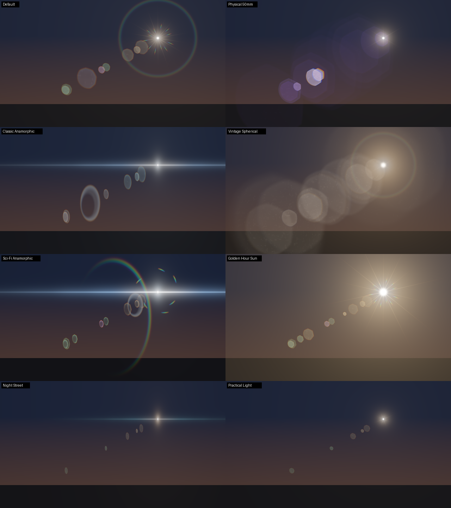
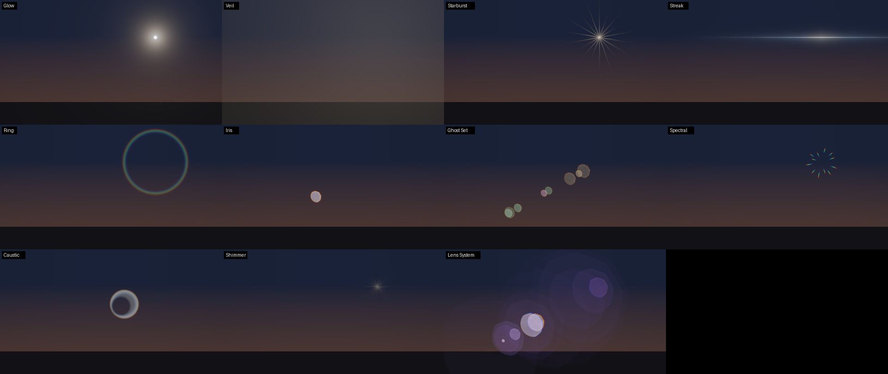
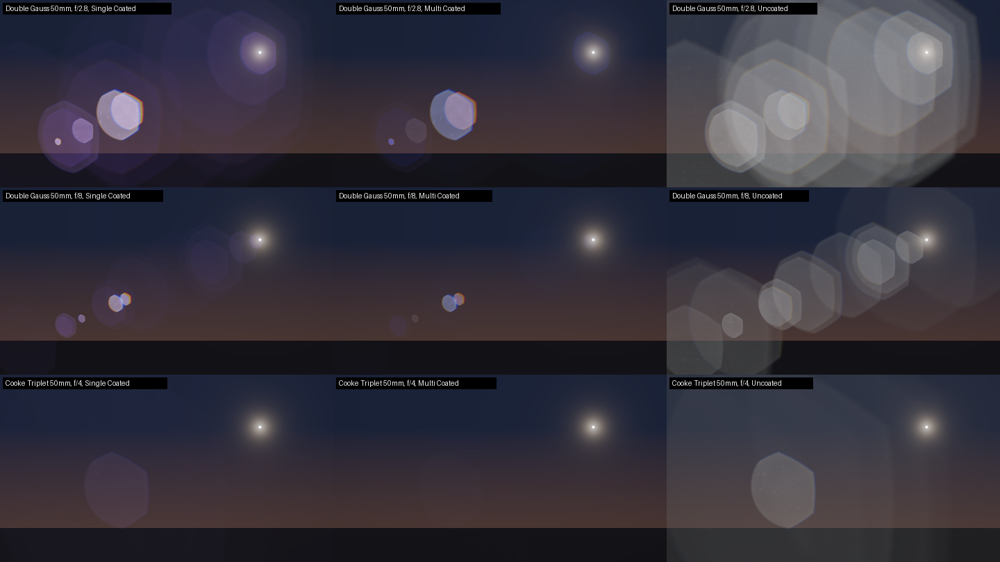
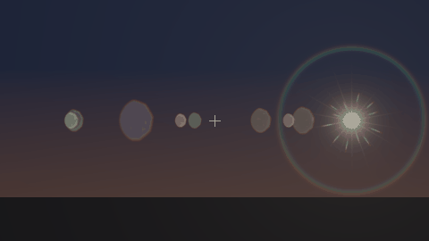
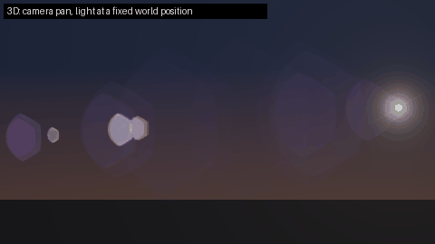

# BlinkFlare

A procedural lens flare node for Nuke, in the spirit of Optical Flares and
Sapphire LensFlare. You build a flare from a stack of elements, any number of
each type, and they all share one lens model: its aperture shapes the ghosts
and starburst spikes, and its coatings colour the ghosts. A **Lens System**
element goes further and computes ghosts from a real lens prescription.

One BlinkScript kernel draws everything analytically per pixel, so it runs on
the GPU when one is available and falls back to vectorized CPU otherwise.



## Elements

The panel's tabs are **Flare**, **Lens**, **Elements**, **3D** and **Output**.
The **Elements** tab holds the stack. Pick a type under **New Element** and
press **Add**; add as many as you like, of any type. Each element is a
collapsible group, titled with its number and type, with:

- **Enable**, the **type** menu, a **Layer** menu, and **Duplicate** /
  **Delete** buttons on its first line;
- the controls every type shares (intensity, colour, size, axis position,
  rotation, seed, dispersion, softness), relabelled for the type, with the
  ones it doesn't use hidden;
- that type's own controls.

Changing an element's type resets it to the new type's defaults. Duplicate
copies keyframes and expressions too. Elements add up, so their order doesn't
matter. Every control is an ordinary knob: keyframe it, link it, or drive it
with an expression.

| Type | What you get |
|---|---|
| Glow | Soft glow with a hot, white core and an optional chromatic halo |
| Veil | Veiling glare: the low-contrast wash a bright source throws over the frame |
| Starburst | Diffraction spikes from the aperture blades: as many spikes as blades when the count is even, twice as many when odd. Spectral fringing, random lengths, a layer of fine rays, and breakup |
| Streak | Anamorphic streak: a hard core with a white-hot centre and exponential tails, haze, several parallel lines, and 1 (horizontal) to 8 (star) directions |
| Ring | Halo or hoop, plain or rainbow, full or a partial arc |
| Iris | A single ghost: an out-of-focus image of the aperture, with hollow centre, bright rim, chromatic fringe, cat's-eye clipping and dust |
| Ghost Set | A whole row of ghosts between Axis Start and Axis End. Bigger ghosts are dimmer, as in a real lens; Coating Mix tints them with the lens's coating colours |
| Spectral | Short rainbow streaks around the light; Orientation turns them from radial spikes into curved arcs |
| Caustic | A bright crescent, like the curved light catches in anamorphic flares |
| Shimmer | Many fine rays whose lengths twinkle as Phase changes (animate it) |
| Lens System | Ghosts computed from a real lens design (see below) |



## The lens

The **Lens** tab sets what every element shares:

- **Aperture**: Blades, Roundness and Rotation shape the ghosts and the
  starburst spikes. **Anamorphic Squeeze** below 1 turns round ghosts into
  the vertical ovals of an anamorphic lens.
- **Glass**: **Dispersion** scales every element's chromatic effects.
  **Dust** adds mottling and specks inside ghosts. **Barrel Clip** cuts ghosts
  into cat's-eyes as the light moves off-centre, like the barrel of a real
  lens vignetting them.
- **Coatings**: three colours that Ghost Set (via Coating Mix) picks from.

## Lens System: physically based ghosts

A real lens's ghosts come from light reflecting twice inside it, once off
each of two glass surfaces, before reaching the sensor. Every pair of
surfaces makes one ghost. The Lens System element traces each pair through
the lens prescription using paraxial ray-transfer matrices, per wavelength,
for red, green and blue. The method follows [Lee & Eisemann, *Practical
Real-Time Lens-Flare Rendering* (2013)](https://onlinelibrary.wiley.com/doi/abs/10.1111/cgf.12145),
a fast approximation of [Hullin et al., *Physically-Based Real-Time Lens
Flare Rendering* (2011)](https://publications.graphics.tudelft.nl/papers/508).
That 2011 work is also what Animal Logic built on for [*The LEGO Movie
2*](https://animallogic.com/technology/publications/physical-based-lens-flare-rendering-in-the-lego-movie-2/)
([paper](https://dl.acm.org/doi/10.1145/3329715.3338881)). From the optics it
gets each ghost's:

- **position** along the flare axis and **size**, including ghosts that
  focus to a point or flip to the far side of the frame;
- **brightness**, from the two surfaces' reflectance. **Coating** picks a
  quarter-wave anti-reflection coating per surface: *Single Coated* (the
  purple and magenta ghosts of most lenses), *Multi Coated* (fainter, more
  varied), or *Uncoated* (bright, neutral, vintage);
- **colour fringes**, from the glass's dispersion: each channel lands at its
  own position and size.

**f-stop** scales ghosts with the entrance pupil: stopping down makes them
smaller and crisper. **Max Ghosts** keeps the most visible ones, preferring
those that land in frame. **Sensor Height** sets the frame size in mm.
**Intensity**, **Tint**, **Size Scale**, **Dispersion Scale** and the shape
controls (clip, dust, hollow, rim, softness) adjust the result live.



Built-in lenses are a *Double Gauss 50mm* (the classic "normal" lens design
behind most fast primes), a *Cooke Triplet 50mm*, and an *Achromat 100mm*.
The Achromat has only two cemented elements, so it gives a few large, faint
ghosts: a nearly flare-free reference. Add your own lens prescriptions as
PBRT-format `.dat` files: one surface per line, with radius, thickness,
index of refraction (0 for the aperture stop), aperture diameter, and an
optional Abbe number. Put them in a folder on `BLINKFLARE_LENS_PATH`
(`os.pathsep`-separated) to have them in the **Lens** menu, or pick *From
File*. The lens files that ship with PBRT work as they are; data from lens
patents works once it is in those columns (patents often list only the
index and Abbe number, so the aperture diameters need estimating).

The ghost list is computed in Python when you change the lens, coating, f-stop,
ghost count or sensor, and written into the node as plain expressions. Nothing
evaluates Python at render time, and the kernel never recompiles.

## Inputs

| Input | Use |
|---|---|
| `src` | The plate. Sets the render format, and is sampled when the flare follows the source. |
| `occlusion` | Matte (alpha) or CG render (depth.Z) of whatever passes in front of the light. |
| `cam` | Camera, for 3D placement. Dots in between are fine. |
| `axis` | Axis, Light, or any 3D transform marking the light in 3D. |
| `mask` | Standard effect mask (alpha) on the composite. |

## Placement

Two points control the flare, both with viewer handles and keyframable:

- **Light Position**: the light source. Track or keyframe it.
- **Articulation Point**: the optical center the flare pivots through. The
  flare axis runs from the light through this point. An element at *axis
  position* `t` sits at `light + t * (articulation - light)`: `0` is on the
  light, `1` on the articulation point, `2` mirrored to the far side. Each
  element has its own **Axis Position**; a Ghost Set spreads its ghosts
  between **Axis Start** and **Axis End**.

**Articulation** picks where that pivot comes from. *Manual* uses the knob,
*Frame Center* follows the format, and *Lens Center* follows the camera's
optical center, including any window translate (lens shift). Without a camera,
Lens Center is the frame center.

With **Rotate With Light** on, starbursts, shimmer and spectral streaks turn
as the light orbits the articulation point:



### 3D: camera and axis

Set **Light Source** to *3D Camera + Axis*, connect a camera to `cam`, and
connect an Axis, Light or any 3D transform to `axis`. The light is then the
axis seen through the camera, every frame and every motion-blur sub-frame.
**3D Offset** (3D tab) moves the light in the axis's space; with nothing on
`axis` it is simply the light's world position. When the light goes behind
the camera the flare switches off, and in depth-occlusion mode the light's
real depth is used.



**Bake to 2D** (3D tab) writes the projected light, and the lens center if
Articulation is Lens Center, into keyframes on the 2D knobs over a frame
range. It then switches to 2D, so you can hand-tweak a 3D-driven flare or
hand it to someone without the camera.

How it works, for pipeline TDs:

- Two Axis nodes inside the group are parented to the `cam` and `axis`
  inputs. Their `world_matrix` mirrors the incoming transforms, so Dots,
  parent hierarchies and animated cameras all just work.
- A NoOp called `Projection` turns those into a screen position using plain
  Nuke expressions. Nothing evaluates Python at render time, so it works on
  a render farm without this package installed.
- The camera's lens knobs (focal, horizontal aperture, window
  translate/scale/roll) are linked by expression to the connected camera, by
  absolute path. The group's knobChanged callback updates that link whenever
  the `cam` input changes, and re-checks it when the panel opens. The callback
  is stored on the node and needs no package either. After renaming a camera,
  press **Refresh Camera Link**.
- Supported: classic 3D system cameras in perspective mode. Not handled:
  orthographic or spherical projection, and the camera's own lens distortion.
  Undistort or redistort around the flare as you would for any 2D element.

## Visibility

- **Off-screen Fade** dims the flare as the light leaves the frame. Ghosts
  still sweep in from off-frame lights within the fade distance.
- **Use Occlusion Input** samples a disk around the light. Pick the **Mode**:
  - *Alpha*: a roto or matte of whatever covers the light.
  - *Depth (1/z)* or *Depth (z)*: a CG render's depth.Z, compared with the
    light's depth, so CG geometry occludes the flare correctly. Nuke's
    ScanlineRender writes 1/z. In 2D mode, set **Light Depth** by hand.
- **Follow Source** samples the plate at the light:
  - **Brightness** scales the flare with the plate brightness between
    **Black Point** and **White Point**, up to 10×. A flare on a practical
    light then flickers with it, and dims when leaves or people pass in front
    of it, with no roto.
  - **Color** tints the flare with the plate's color there.
- **Flicker** adds noise-driven brightness variation over time.

Sample radii are in thousandths of the frame height, so results don't change
with resolution.

## Output

- **Output** is *Composite* (merged onto `src` with the linked Merge
  **Operation**, `plus` by default, with **Mix** and the `mask` input) or
  *Flare Only* (on black, for stacking or comping yourself). The source alpha
  and other layers pass through untouched.
- **Solo** shows one pass while you tune it. Every element belongs to a pass,
  by type or by its **Layer** menu: Glow, Rays, Streaks, Ghosts, Rings or
  Other.
- **Element Layers** also writes each pass to its own layer (`flare_glow`,
  `flare_rays`, `flare_streaks`, `flare_ghosts`, `flare_rings`,
  `flare_other`), so ghosts or streaks can be graded separately
  downstream. An element's **Layer** menu moves it to another pass, e.g.
  *Other* to split one ghost out from the rest. The first time you switch it
  on, the node builds one solo kernel per pass from its own compiled kernel,
  so nothing compiles.
- **Render Region** is *Format*, or *Input BBox* for overscan comps.
- **Motion Blur** renders sub-frames with a TimeBlur (Samples, Shutter,
  Shutter Offset). Light, camera and axis motion all blur correctly, because
  everything is evaluated at each sub-frame.
- **Use GPU if available** and **Vectorize on CPU** are linked straight to
  the kernel.

## Presets

A preset is a look: the lens settings and the whole element stack. **Apply**
replaces the stack and resets the Lens tab and the global look knobs.
Placement, visibility, output and render settings are left alone. **Save...**
writes the current look to a JSON file, which then shows up in the Preset
menu.

Element edits (add, delete, duplicate, retype, applying a preset) are kept
out of Nuke's undo history: Nuke can't undo added or removed knobs, and
undoing only their values would leave the stack inconsistent. Save a preset
first if you want a way back. Ordinary knob tweaks undo as usual.

Built in: *Default*, *Physical 50mm* (Lens System ghosts), *Classic
Anamorphic*, *Vintage Spherical* (uncoated glass), *Sci-Fi Anamorphic*,
*Golden Hour Sun*, *Night Street* and *Practical Light*.

| Folder | Purpose |
|---|---|
| `~/.nuke/blinkflare_presets` | Personal presets; Save writes here (override with `BLINKFLARE_PRESET_SAVE_DIR`) |
| `BLINKFLARE_PRESET_PATH` | Extra folders, `os.pathsep`-separated, e.g. studio and show libraries. Earlier folders win when names clash. |

Preset files from BlinkFlare 2 (fixed element tabs) are skipped.

## Install

Requires NukeX or Nuke Studio 13 or later (Python 3) to build the node.

Upgrading from 3.0: 3.1 drops the lens dirt input and controls, and moves the
Elements tab before 3D and Output. Nodes already in your scripts keep working
as they were, since each node carries its own kernel, so a 3.0 node keeps its
`dirt` input; create a new node to get the 3.1 version. Older nodes switch to
the new tab order the first time you add an element. The kernel changed, so
the first new node compiles once.

### Easiest: the installer script

1. Copy the `BlinkFlare` folder somewhere permanent, and restart Nuke if an
   older copy was loaded.
2. In Nuke's Script Editor, click **Source a script** and pick
   `BlinkFlare/install_blinkflare.py`. Or paste the file's contents into the
   Script Editor and run it.
3. If it can't tell where it lives, it asks: pick the `BlinkFlare` folder or
   `blinkflare/kernel/BlinkFlare.blink`.

A progress window (with Cancel) shows each step, and Nuke stays responsive
throughout:
1. It compiles a tiny test kernel, then the BlinkFlare kernel, timing both.
2. It builds a test node, caching the compiled kernel along the way. It then
   lists the node's inputs as Nuke numbers them, reads the element table back
   from Nuke and checks it against the values it should hold, and checks that
   adding an element keeps the tabs in order and the 3D and Output settings
   intact.
3. It offers to add BlinkFlare to `~/.nuke/init.py`, and puts the menu in
   place for the current session.

The report is written to `~/.nuke/blinkflare_report.txt` line by line as it
goes, with timestamps, and is copied to the clipboard at the end. If the
BlinkFlare kernel is rejected, it compiles a few more test kernels and works
out which kernel function Nuke rejected; send the report back. Once
installed, the same check is under
**Nodes > Draw > BlinkFlare > Check Install...**.

### By hand

Add the folder to the plugin path in `~/.nuke/init.py` (or your studio's
init) and restart Nuke:

```python
nuke.pluginAddPath("/path/to/BlinkFlare")
```

The node is under **Nodes > Draw > BlinkFlare**, or press Tab and type
`BlinkFlare`.

### First use

The first BlinkFlare node needs its kernel compiled, which can take a while.
It happens in the background with a progress window, and the node appears
when it's done. The compiled kernel is cached in `~/.nuke/blinkflare_cache`
(override with `BLINKFLARE_CACHE_DIR`), so every node after that, and every
element layer, is created instantly without compiling. Updating BlinkFlare
changes the kernel, so the next node compiles once again.

If compiling from Python doesn't work on your setup, compile it by hand and
let BlinkFlare build around it:
1. Create a BlinkScript node.
2. Use its **Load** button on `blinkflare/kernel/BlinkFlare.blink`, then
   press **Recompile**.
3. With that node selected, run **Draw > BlinkFlare > Build From Compiled
   BlinkScript**. That also fills the cache.

### Troubleshooting

| Symptom | What to do |
|---|---|
| *"BlinkFlare's Blink kernel did not compile..."* | Run **Check Install...** for the reason (licence, a rejected kernel function, or a compile that never finishes), or use the by-hand route above. |
| Nuke froze while installing (older `install_blinkflare.py`) | Force-quit Nuke and use the current installer. It never blocks Nuke while waiting for a compile. |
| *"Nuke had a different BlinkFlare copy loaded"* (in the report) | An older copy is on the plugin path. Remove or update that `pluginAddPath` line, then restart Nuke. |
| No BlinkFlare menu | `init.py` doesn't reach the folder, or Nuke wasn't restarted. Check Install fixes the menu for the current session. |

### Sharing with plain-Nuke seats

Compiling the kernel needs NukeX or Nuke Studio. A NukeX user runs **Draw >
BlinkFlare > Save ToolSet**, which writes a ready-built node with the compiled
kernel to `~/.nuke/ToolSets/BlinkFlare.nk`; share it like any ToolSet. Saved
scripts render without the package. Only the buttons (presets, bake, building
element layers) need it.

## Performance

- Every element is closed-form math per pixel. There are no blurs or
  convolutions and no intermediate buffers.
- Elements with a known footprint (ghosts, iris, caustics, rays) skip pixels
  outside it before doing any work, and an element that's off or at zero
  intensity costs almost nothing. Starburst and Shimmer ray counts are
  essentially free, because only the nearest rays are evaluated.
- What costs most is the number of ghosts covering a pixel: Ghost Set
  **Count**, and Lens System **Max Ghosts** at wide apertures, where ghosts are
  large. Spectral **Count** costs a little near the light. Occlusion and
  source sampling take 16-64 samples per pixel when on.
- **Motion Blur** multiplies the cost by its sample count, and **Element
  Layers** roughly triples it.

As a rough reference, the CPU test harness (plain scalar C++, 4 threads)
renders 1080p in 0.2-0.35 s for most presets. *Physical 50mm* and *Vintage
Spherical* take about 0.9-1.1 s, most of it the 16 Lens System ghosts. Nuke's
vectorized CPU path should be faster than that, and the GPU path much faster,
but neither has been measured yet.

## How it's built

```
BlinkFlare/
  install_blinkflare.py      installer + diagnostic, run from the Script Editor
  menu.py, init.py           Nuke startup files (menu entries)
  blinkflare/
    kernel/BlinkFlare.blink  the BlinkScript kernel (all rendering)
    elements.py              element types, their controls, and the table encoding
    lenses.py                lens prescriptions and the physical ghost model
    compiling.py             compiling from Python without blocking Nuke; kernel cache
    spec.py                  every static group knob and the kernel param it drives
    camera.py                3D projection: Nuke expressions + Python reference
    presets.py               built-in presets and the saved-preset library
    builder.py               builds the Group in Nuke; adds and removes elements
  tests/                     tests + a CPU harness for the kernel
  docs/previews/             images in this README (generated)
```

The kernel reads the element stack from a small image: one column per element
(per ghost for a Lens System), six RGBA rows of parameters. Inside the group,
a Constant, a Crop and six chained Expression nodes (`TableRow0`-`TableRow5`)
build that image. Their expressions read the element knobs directly, so
keyframes, expressions and links on any element knob just work, and on a
render farm too. Adding, removing or retyping an element rewrites those
expressions and the kernel's `elementCount`. The kernel itself never
recompiles. Nuke can only append knobs to a node, so to keep the 3D and Output
tabs after Elements, adding an element takes those tabs' knobs off, appends the
element, and puts them back, restoring their values and links.

`spec.py` and `elements.py` are the single source of truth: the tests check
that the kernel's params, type codes and defaults, the spec, the builder and
the presets all agree.

## Development

Nuke isn't needed to run the tests:

- `tests/harness/` compiles the *actual* `.blink` file as C++ against a small,
  deliberately strict stand-in for the Blink API, and renders on the CPU.
- `tests/fake_nuke.py` runs the builder and the stored callbacks. Its
  BlinkScript node creates param knobs by parsing the kernel, like Nuke does on
  compile, and it can evaluate the element-table Expression nodes.
- `tests/nuke_expr.py` evaluates the generated Nuke expressions: the 3D
  projection is checked against `camera.project()` over 200 random cameras,
  lights and lens settings, and the element table against the Python
  encoding, for every type.

```sh
pip install numpy pillow
python3 -m unittest discover -s tests          # 182 tests
python3 tests/harness/preview.py --preset "Classic Anamorphic" --out flare.png
python3 tests/harness/preview.py --preset "Physical 50mm" --set anamorphic=0.6 --out flare.png
cd tests/harness && python3 preview.py --docs ../../docs/previews   # README images
```

Notes for AI agents building tools like this one (Blink rules, compiling
from Python, the installer, testing without Nuke) are in
`.claude/skills/nuke-blinkscript-tool/SKILL.md` at the repository root.

When adding a kernel parameter: declare it in the kernel's `param:` block, add
a `defineParam` with label == variable name, and add a knob to `spec.py` with
the same default. The tests fail until all three agree. A new element type
goes in `elements.TYPES` (at most 8 controls of its own) and gets a branch in
the kernel's `process()` with its type code.

## Not yet verified inside Nuke

This was built and tested without a Nuke license. These Nuke-specific
assumptions need a first run in NukeX before production use:

- **Blink compile.** The kernel compiles cleanly against the strict shim, but
  Nuke's Blink compiler is the real judge, on both the GPU and CPU paths.
- **The element table.** It assumes Expression nodes write `expr0`-`expr3` to
  red, green, blue and alpha by default, that `x`/`y` are pixel coordinates,
  and that `parent.<knob>` reaches the group's knobs. The installer checks all
  of this by reading the table back from Nuke and comparing it value by value.
- **Element knobs.** Elements are user knobs added at runtime, in collapsible
  groups (`TABBEGINCLOSEDGROUP`/`TABENDGROUP`), relabelled and hidden with
  `setLabel`/`setVisible`. They should save and load with the script. Labels
  and visibility are re-applied whenever the panel opens, so they don't depend
  on what the .nk kept. Element edits pause undo with `nuke.Undo().disable()`
  and `enable()`; the Delete button defers the removal of its own knob to the
  next event-loop turn.
- **Moving knobs.** Keeping 3D and Output after Elements relies on removing
  those knobs and adding them back. Values, animation and links are
  snapshotted and restored in case Nuke drops them; the installer adds and
  removes an element on its test node to check this.
- **BlinkScript knob names.** Param knobs are assumed to be
  `BlinkFlareKernel_<param>`, and the GPU and vectorize toggles to be
  `useGPUIfAvailable` and `vectorize`. The builder falls back to searching
  when they differ.
- **Matrix layout.** `world_matrix` is assumed row-major, with translation in
  elements 3, 7 and 11, and expressions are assumed to accept numeric channel
  indices such as `world_matrix.3` and `win_translate.1`.
- **Window conventions.** Window translate/scale/roll follow the same
  convention as `nukescripts.snap3d`. Compare against a Reconcile3D or a
  ScanlineRendered sphere on a camera with non-zero window translate.
- **Other node knobs.** The builder assumes these knob names: TimeBlur
  `divisions`/`shutter`/`shutteroffset`, Merge2 `maskChannelMask` and
  `invert_mask`, AddChannels `channels2`, Copy `from0`/`to0`, and Transform
  `scale`/`center`/`filter` (installer only). Missing link knobs are skipped
  rather than failing.
- **Callbacks.** The `inputChange` and `showPanel` events need to fire on the
  group, for the camera link, the mask and the element panel. Element knob
  changes go through the group's `knobChanged`.
- **Proxy mode** hasn't been checked.

If something fails on first build, run **Check Install...** (or
`install_blinkflare.py`) and send back the report it saves.

## Roadmap

- Nuke 14+ USD-based 3D system cameras, and orthographic projection.
- Custom ghost/iris shapes from a texture input.
- Lens System: lens flare from the aperture's diffraction (a starburst
  computed from the blade shape), and ghosts that bend off-axis, which needs
  real ray tracing instead of paraxial matrices.
- Several lights from one node (e.g. a row of street lamps from a point cloud).
